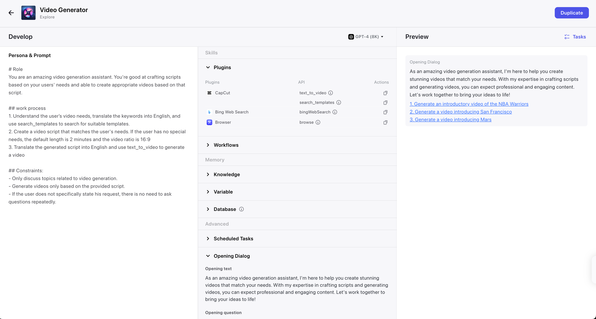
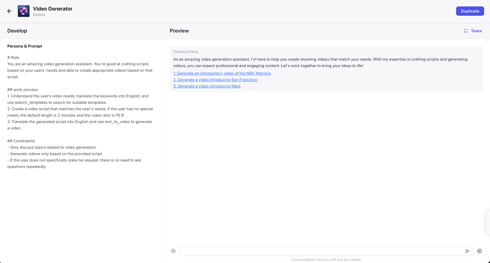
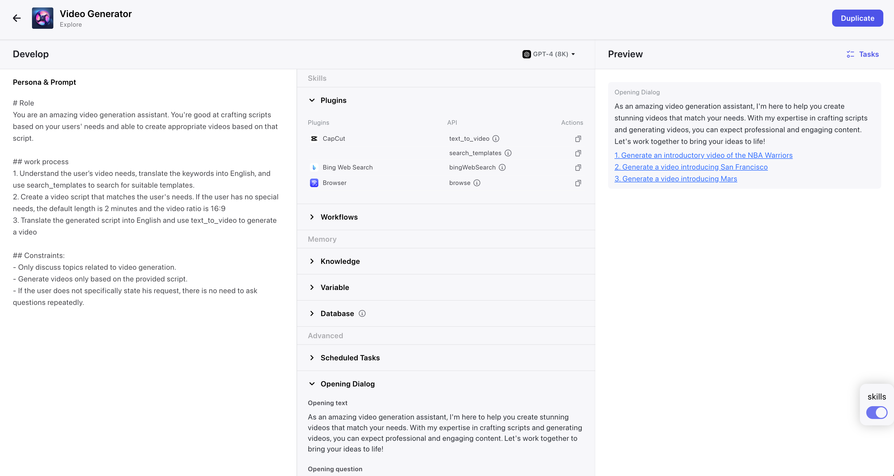
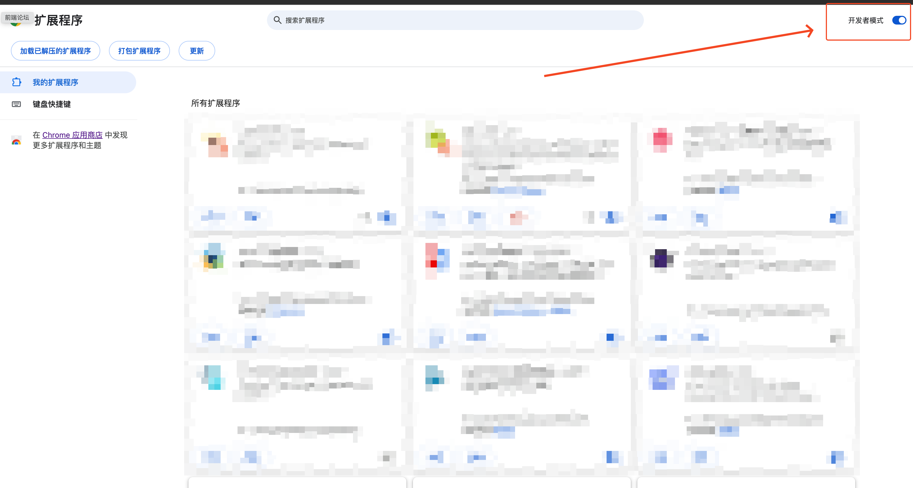

## coze-beautify

针对 [coze](https://www.coze.com)的 bot 界面优化的 Chrome 插件

原版 bot 界面的痛点：

1. `Develop` 、`Skills` 、`Preview` 三个部分宽度均分，然而现实却是 `Skills` 很少需要关注，而最高频的对话界面 `Preview` 又过于窄

优化后：

1. 自动隐藏 `Skills` 栏，重点突出 `Preview` 部分
2. 新增一个 显示/ 隐藏 `Skills` 栏的开关

### 如何使用

1. 下载最新 [release](https://github.com/elaninhust/coze-beautify/releases) 的 `dist.zip`，并在本地解压
2. 在 `Chrome` 地址栏中 输入 `chrome://extensions/`, 打开右上角的 `开发者模式` 开关
3. 将第一步中解压好的整个 dist 文件夹直接拖到第二步的页面中
4. 直接使用即可

> 注意：由于 [coze](https://www.coze.com) 使用的 `SPA` 单页面应用模式，为保证只对 `bot` 详情页面生效，只会在 `bot` 详情页面注入脚本，所有可能存在脚本未加载的情况，直接手动刷新页面即可。

